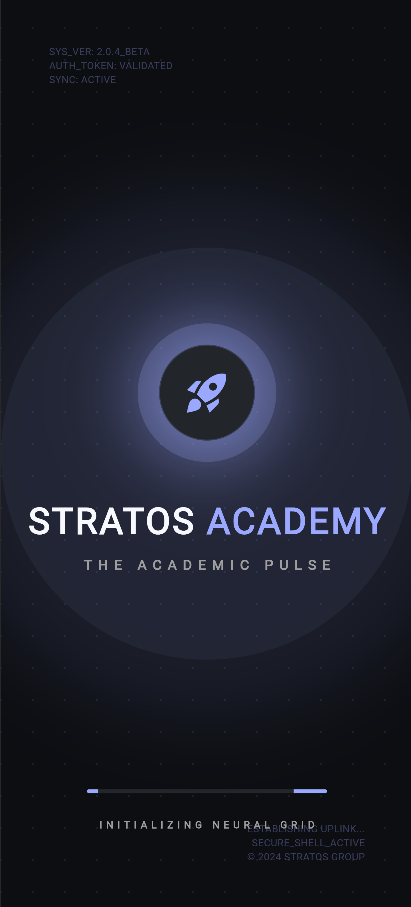
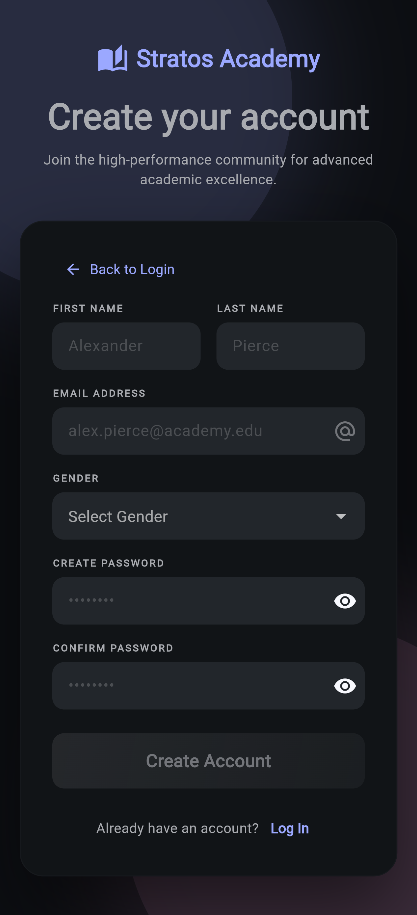
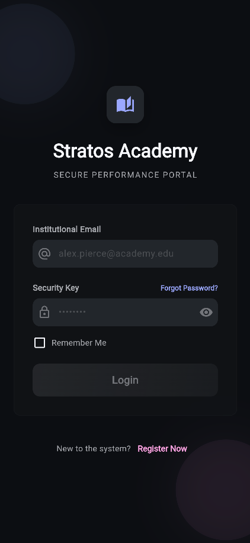
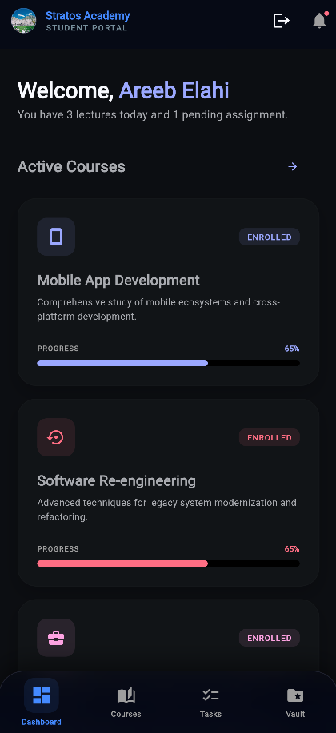
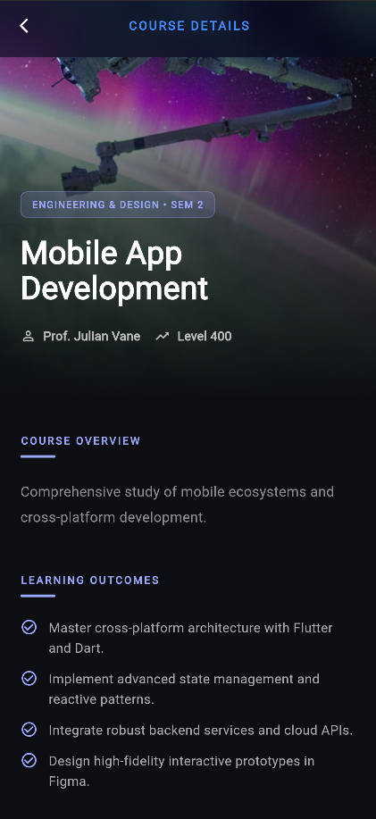
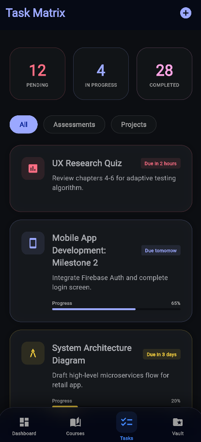
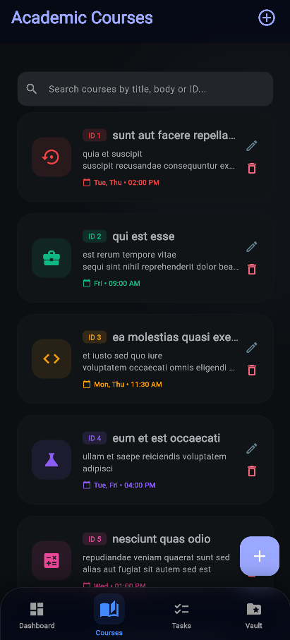

# Stratos Academy - Student Portal

A high-performance academic management application built with Flutter, featuring a premium glassmorphic UI, persistent authentication, and real-time validation.

## Student Information
- **Student Name:** Areeb Elahi
- **Student ID:** SE221010

---

## Features
- **Splash Screen**: Dynamic brand entrance with neural grid animations.
- **Authentication**: Secure registration and login system with local session persistence.
- **Dashboard**: personalized student portal displaying active courses and academic performance metrics.
- **Course Details**: Comprehensive view of course syllabus, schedules, and progress tracking.
- **Task Management**: Integrated task board for tracking academic assignments and deadlines.

---

## Application Screenshots

### 1. Splash Screen
The portal entrance featuring a secure neural uplink animation.

 

### 2. Registration Screen
Secure account creation with real-time field validation and gender selection.

 

### 3. Login Screen
Secure authentication portal with institutional email validation and password visibility toggles.

 

### 4. Student Dashboard
Dynamic overview of the student's academic journey and active courses.

 

### 5. Course Details
Deep dive into specific course metrics, schedules, and learning objectives.

 

### 6. Tasks & Assignments
Organized management of pending academic tasks.

 

### 7. Academic Courses (API Integration)
Management portal integrating the JSONPlaceholder API. Fetches, searches, creates, updates, and deletes courses dynamically.

 

---

## Course Registration & Dashboard Flow

To register for a course and view it on your student dashboard, follow these steps:

1. **Navigate to the Courses Tab**: Open the navigation drawer or bottom navigation bar and select the **Courses** tab. This opens the **Academic Courses** screen, which fetches the latest course list from the JSONPlaceholder API.
2. **Select a Course**: Click on the course card you want to enroll in. This navigates you to the **Course Details** screen.
3. **Register**: In the side details panel on the Course Details screen, click the gradient **Register for Course** button.
4. **Enrollment Status**: Once clicked, the button is hidden and replaced by a read-only green **✓ You are Enrolled** badge, indicating successful enrollment. This state is persisted locally using `SharedPreferences`.
5. **View on Dashboard**: Navigate back to the **Dashboard** screen.
   - *Initially (before any registration)*: The **Active Courses** section on the Dashboard is empty, showing a placeholder card stating that there are no registered courses and prompting you to register.
   - *After Registration*: The course you just enrolled in dynamically appears under the **Active Courses** section with a calculated progress bar.
6. **Access Enrolled Course Details**: Tap on the course in the Dashboard list to return to the Course Details screen. The page will persistently show the **✓ You are Enrolled** badge, with no options to re-register.

---

## Technical Stack
- **Framework**: Flutter
- **State Management**: Provider (CourseController & AuthController)
- **Storage**: SharedPreferences (Persistent Session & Course Enrollments)
- **Network**: http (REST client targeting JSONPlaceholder API)
- **UI Architecture**: Custom Glassmorphism Design System

## Getting Started

To run this project locally:

1. Ensure you have the Flutter SDK installed.
2. Clone the repository.
3. Run `flutter pub get` to install dependencies.
4. Run `flutter run -d chrome` (or your preferred device).

---

## API Integration (Assignment 2)
- **API Used**: [JSONPlaceholder](https://jsonplaceholder.typicode.com/)
- **Documentation Reference**: [JSONPlaceholder Guide](https://jsonplaceholder.typicode.com/guide)
- **Branch Name**: `feature/course-api-integration`
- **Architecture**: Separate Service Layer (`lib/services/course_service.dart`), State Management Controller (`lib/controllers/course_controller.dart`), and UI Page (`lib/views/courses_screen.dart`).

### API Screenshots
- **Courses Screen API List**: Fetches course data dynamically from JSONPlaceholder `/posts` with support for loading and error states.

  

- **Add Course Dialog**: sliding bottom sheet to input Title and Description, sends POST to API, and prepends mock response.
- **Update Course Dialog**: Pre-fills course details, sends PUT to API, and applies changes.
- **Delete Course Action**: Confirms action and makes DELETE API call, removing item from local state.

